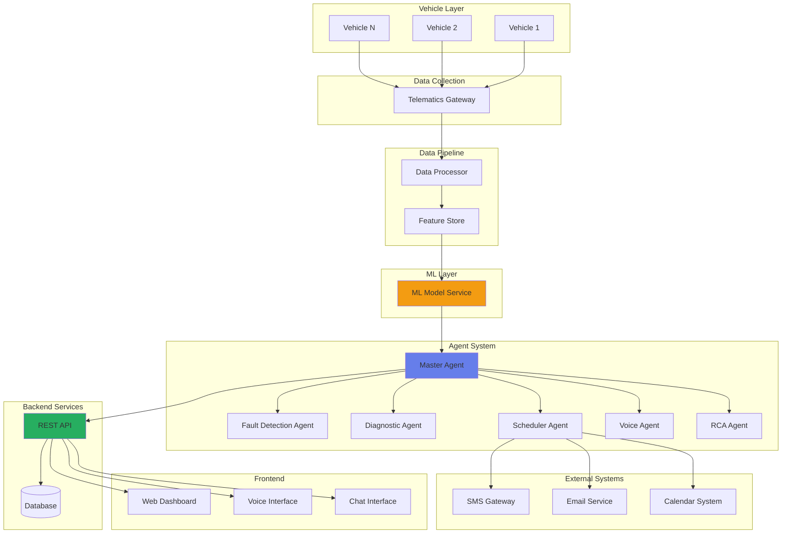
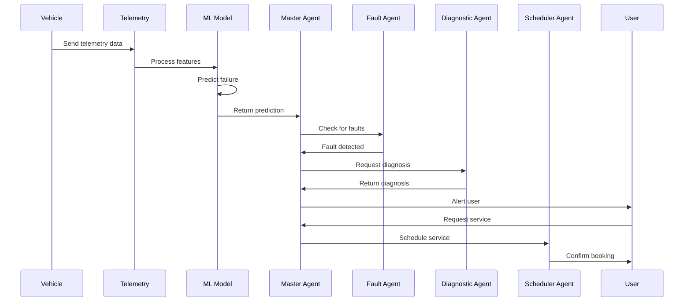
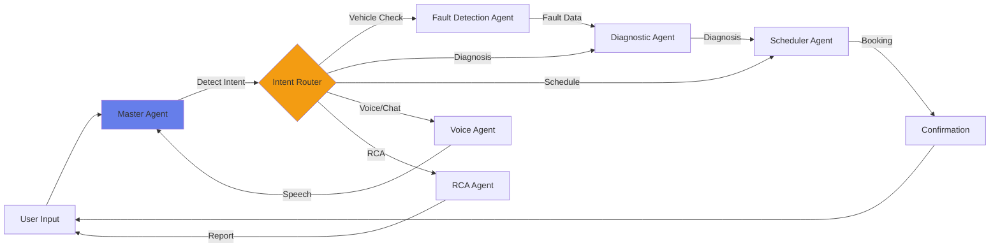
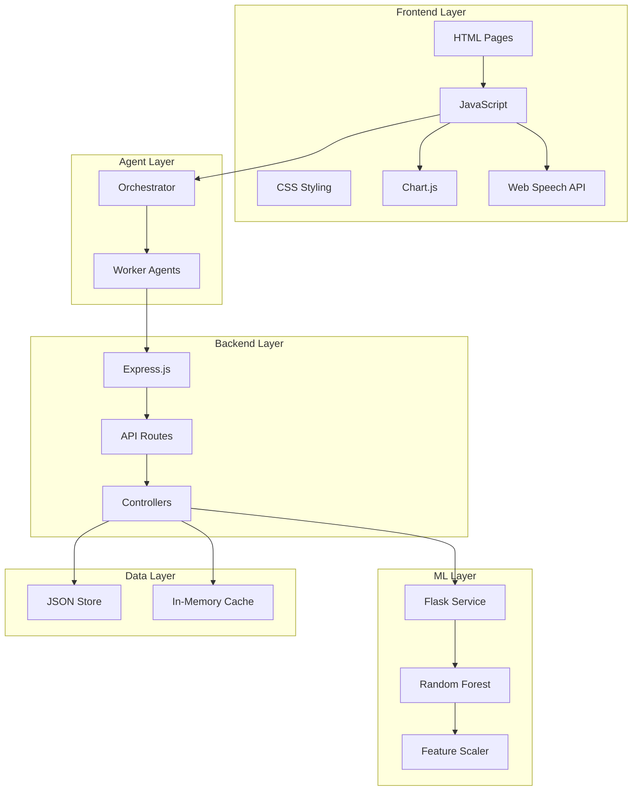
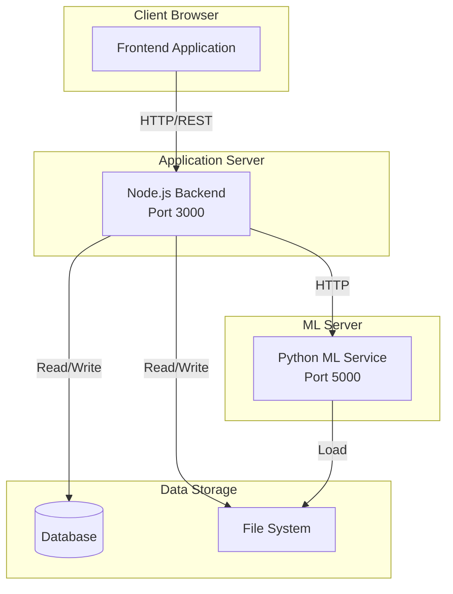

# Aerix System Architecture

## System Architecture Diagram

## Data Flow Diagram

## Agent Interaction Diagram

## Component Architecture

## Deployment Architecture

## Key Features

### 1. Predictive Maintenance
- Real-time telemetry monitoring
- ML-based failure prediction
- Component-level risk assessment
- Time-to-failure estimation

### 2. Agentic System
- Master Agent orchestration
- Specialized worker agents
- Intent detection and routing
- Context-aware responses

### 3. Voice & Chat Interface
- Web Speech API integration
- Male/Female voice selection
- Natural language processing
- Conversational flow

### 4. Autonomous Scheduling
- Automatic slot detection
- Calendar integration
- Confirmation workflow
- SMS/Email notifications

### 5. RCA Engine
- Root cause analysis
- Evidence collection
- CAPA generation
- Manufacturing insights

## Technology Stack

### Frontend
- HTML5
- CSS3 (with animations)
- Pure JavaScript (ES6+)
- Chart.js for visualization
- Web Speech API

### Backend
- Node.js
- Express.js
- CORS middleware
- Body-parser

### ML
- Python 3.8+
- Flask
- scikit-learn
- pandas, numpy
- joblib

### Data
- JSON file storage
- In-memory caching
- CSV for training data
